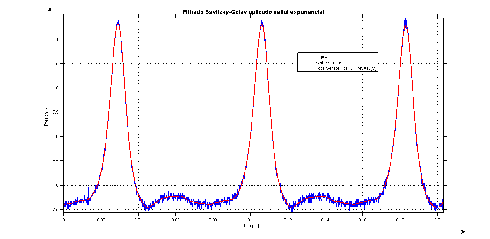
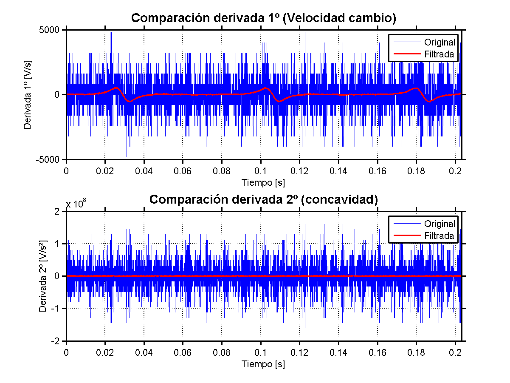
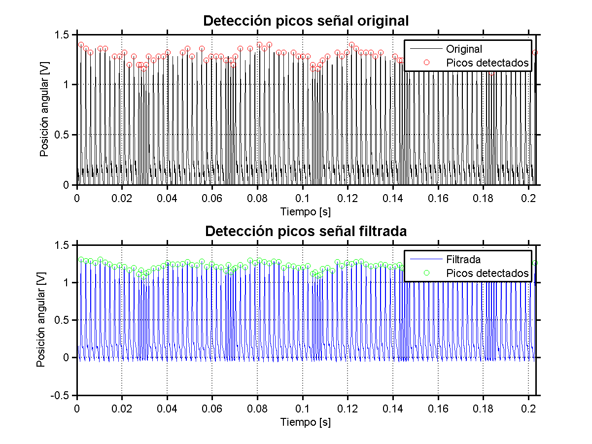
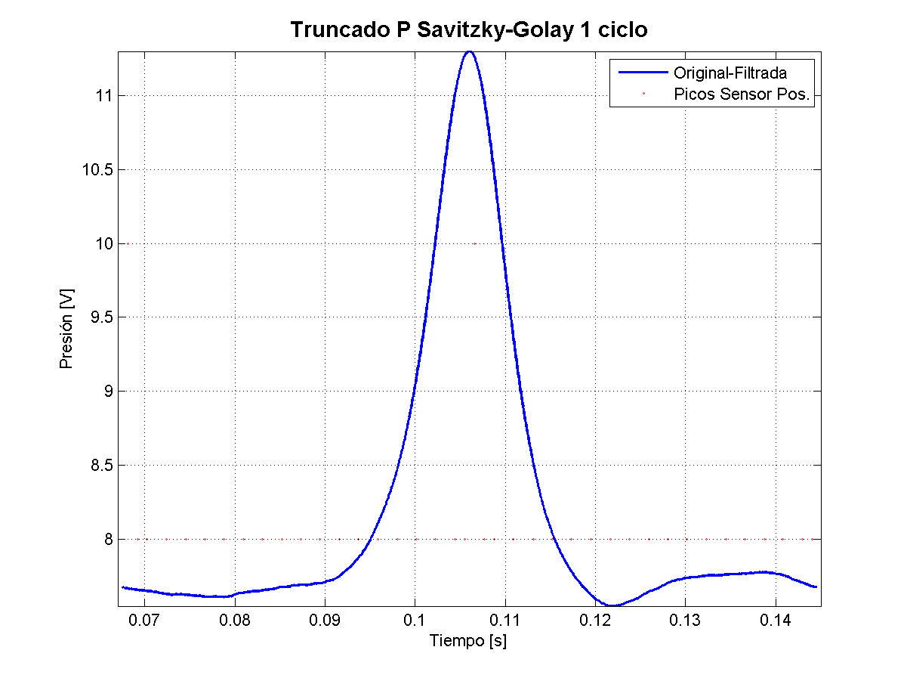
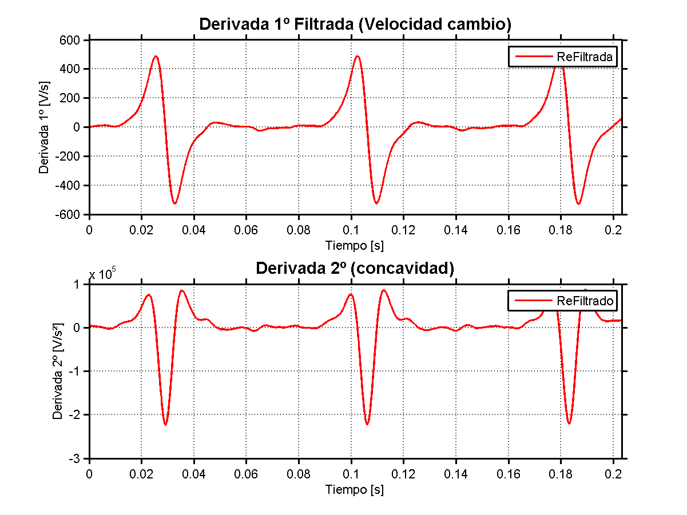

# FILTRO Savitzky-Golay

  

Desarrollo de un filtro para señales de osciloscopio de presión instantánea dentro de la cámara de combustión en CH1 y señales de posición angular en CH2

# Análisis de Señales de Presión y Posición Angular con Filtro de Savitzky-Golay

Este script de MATLAB realiza el procesamiento, filtrado, análisis estadístico y visualización de señales adquiridas desde un osciloscopio de dos canales. Está diseñado para evaluar la calidad de señales de presión y posición angular en sistemas de combustión, aplicando técnicas de suavizado, detección de picos y análisis temporal.

---

## 📁 Archivos de entrada

- `WaveData96.csv`: Señal de presión (canal CH1)
- `WaveData97.csv`: Señal de posición angular (canal CH2)

Ambos archivos deben contener encabezados con metadatos (`timebase`, `voltbase`, `size`) seguidos de columnas de tiempo y señal.

---

## ⚙️ Funcionalidades principales

### 1. **Carga y normalización de datos**
- Extrae escalas de tiempo y tensión desde los encabezados.
- Convierte unidades a segundos y voltios.
- Reemplaza valores negativos en la señal angular por cero.

### 2. **Filtrado Savitzky-Golay**
- Aplica suavizado polinomial a ambas señales:
  - Presión: orden 2, ventana 151
  - Ángulo: orden 3, ventana 11 (verificar para detectar los picos angulares)

### 3. **Validación del filtrado**
- Calcula derivadas primera y segunda de la señal de presión (original y filtrada).
- Detecta picos en la señal angular filtrada y los marca con valor arbitrario `8`.

### 4. **Análisis de picos de presión**
- Detecta picos mayores al 90% del valor máximo.
- Calcula:
  - Tiempos de ocurrencia
  - Valor promedio y desvío estándar
  - Diferencias temporales entre picos
  - Tiempo de muestreo global (`Ts`) y frecuencia (`Fs`)
  - Estimación de RPM basada en los picos

### 5. **Truncado centrado**
- Centra un intervalo temporal alrededor del pico medio de presión.
- Extrae subconjuntos truncados de presión y posición angular.

### 6. **Análisis de densidad angular**
- Detecta grupos de 5 eventos consecutivos con muestreo denso (basado en `dt_8`).
- Marca el valor central de cada grupo con `10` en `a_suavex_mod`.

### 7. **Estadísticas de eventos angulares**
- Calcula diferencias temporales entre eventos con valor `10`.
- Informa:
  - Promedio y desvío estándar temporal
  - Conversión a RPM y su desvío

---

## 📊 Visualizaciones

### Figura 1: Señal de presión
- Original vs. filtrada
- Eventos angulares marcados

### Figura 2: Derivadas de presión
- Comparación entre señal original y filtrada
- Derivada primera (velocidad)
- Derivada segunda (concavidad)

### **Figura 3**: Derivadas filtradas de presión
- Derivada primera y segunda exclusivamente sobre señal suavizada

### **Figura 4**: Detección de picos en señal angular
- Subplot 1: señal original con picos detectados
- Subplot 2: señal filtrada con picos detectados

### **Figura 5**: Truncado de presión
- Visualización de un ciclo centrado en el pico medio
- Comparación con eventos angulares

### **Figura 6**: Reasignación de valores en eventos densos
- Comparación entre señal original (`a_suavex`) y modificada (`a_suavex_mod`) con valor `10` en centros de muestreo denso

### **Figura 7**: Refiltrados de derivadas 1º y 2º
- Filtrado de las derivadas de Presión derivada 1º(`dp_suave1`)  yderivada 2º(`ddp_suave2`)
- 
---

## 📌 Requisitos

- MATLAB R2018b o superior
- Función `sgolayfilt` (Signal Processing Toolbox)
- Archivos `.csv` con formato compatible

---

## 🧠 Notas técnicas

- El script asume **muestreo temporal uniforme**, validado desde el encabezado del archivo.
- Las conversiones a RPM suponen que los eventos representan ciclos completos o fracciones conocidas.
- El truncado se centra automáticamente en el pico medio de presión para análisis comparativo.

---

## 🏷️ Autoría y trazabilidad

Este script fue desarrollado para análisis institucional de señales en sistemas de combustión. Incluye validaciones estadísticas, detección de eventos y visualización técnica para documentación reproducible.

---

## 📂 Estructura de salida esperada

- Consola: métricas estadísticas, tiempos de eventos, RPM
- Figuras: comparativas de señal, derivadas, eventos marcados

---

## 🧪 Aplicaciones sugeridas:

• Análisis de Combustión en motores de combustión interna
• Calibración / Verificación de sensores
• Análisis de señales experimentales
• Introducción a estadística aplicada en ingeniería
• Prácticas de laboratorio en física o mecánica

---
---

## 📍 Ubicación y contacto:
**Facultad de Ingeniería del Ejército "Grl. Div. Manuel N. Savio"**  
 Av. Cabildo 15, C1426AAA Ciudad Autónoma de Buenos Aires, Argentina   
📞 Teléfono: (+54 11) 4779-3300  
 e-mail Institucional: [info@fie.undef.edu.ar](mailto:info@fie.undef.edu.ar)  
 e-mail Laboratorio: [automotores@fie.undef.edu.ar](mailto:automotores@fie.undef.edu.ar)  
🌐 Sitio web: [www.fie.undef.edu.ar](https://www.fie.undef.edu.ar)  
📌 [Google Maps](https://www.google.com/maps?q=Av.+Cabildo+15,+C1426+Ciudad+Aut%C3%B3noma+de+Buenos+Aires,+Argentina)  
<a href="https://web.whatsapp.com/send?phone=5491138569689&text=Hola%2C+quisiera+consultar+sobre+el+Laboratorio+de+Automotores." target="_blank">
   Mensaje Institucional FIE
</a>  

---

## 📝 Licencia

Este proyecto se distribuye bajo licencia institucional para fines educativos y de simulación técnica.  
Para uso público, incluir atribución a Gerhard Raith y enlace al notebook original.
